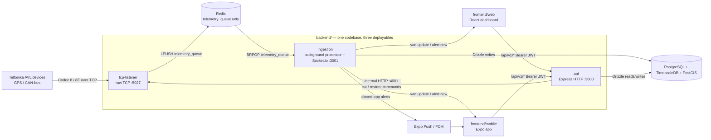
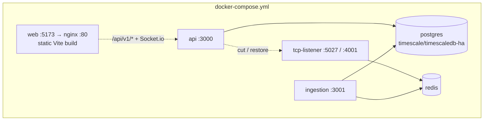
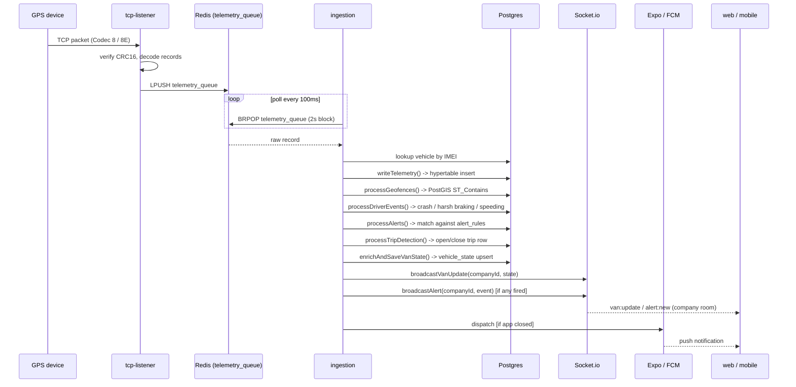
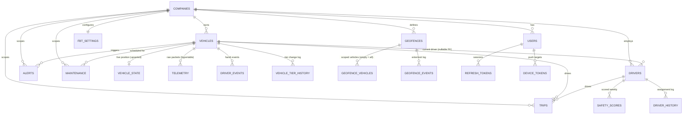
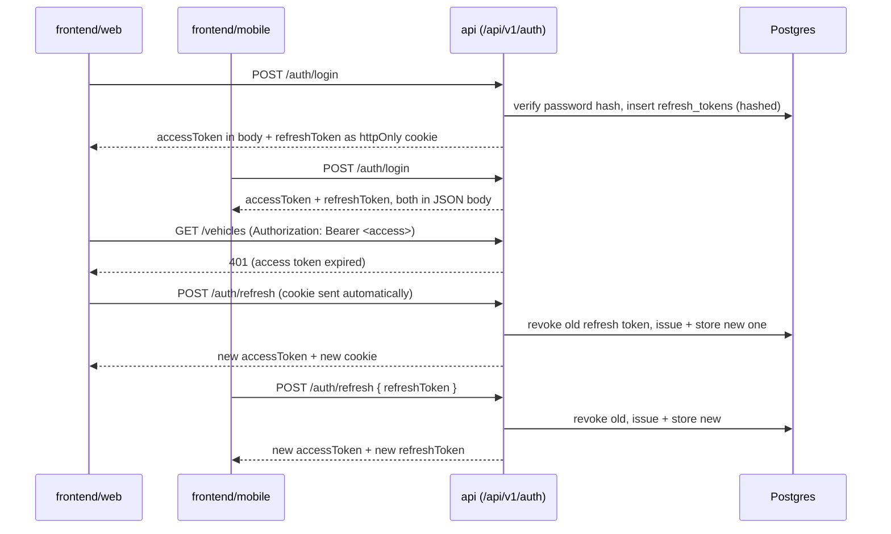
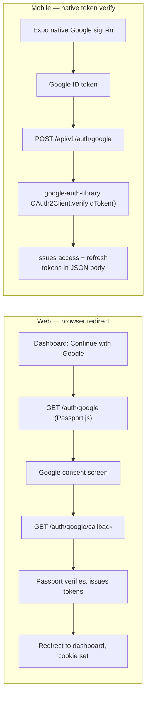

# Clarity Fleet

Fleet telemetry platform: GPS/CAN-bus tracking, geofencing, driver safety scoring, FBT trip
classification, maintenance, and billing — served to a web dashboard and a mobile app from one
unified API, fed by a real-time telemetry pipeline from Teltonika AVL devices.

This document describes the architecture **after** the MongoDB → PostgreSQL and
six-folder → two-folder migration (see [Migration history](#migration-history) at the bottom for
what changed and why).

## Contents

- [System overview](#system-overview)
- [Repo structure](#repo-structure)
- [Backend: one codebase, three deployables](#backend-one-codebase-three-deployables)
- [TCP re-write: cutting cellular data usage](#tcp-re-write-cutting-cellular-data-usage)
- [Telemetry pipeline](#telemetry-pipeline)
- [Database](#database)
- [Auth](#auth)
- [API](#api)
- [Real-time & notifications](#real-time--notifications)
- [Redis's one job](#rediss-one-job)
- [Frontend](#frontend)
- [Local development](#local-development)
- [Migration history](#migration-history)

## System overview



Both frontends see the **same live vehicle positions** through the same pipeline — there is no
separate "mobile API" or duplicated ingestion path.

## Repo structure

```
backend/                     One codebase, three deployable entrypoints
  src/
    entrypoints/
      api.ts                 HTTP API (Express), serves web + mobile identically
      tcp-listener.ts        Raw TCP server for GPS/telemetry devices (Teltonika AVL)
      ingestion.ts            Background processor: telemetry -> trips/alerts/scores, hosts Socket.io
    modules/
      tcp-listener/           Codec 8/8E parser, CRC16, socket registry, command relay
      ingestion/               Enrichment, geofencing, trip-builder, alerts, safety-score/maintenance/licence crons
      auth/                    Tokens, passwords, Passport (web), google-auth-library (mobile)
      fleet/                   Vehicles, drivers, trips, telemetry, geofences, maintenance, FBT, alerts, IMEI
      admin/                   Superadmin console, reports, settings, support, referrals
      billing/                 Stripe billing (optional — degrades gracefully if unconfigured) + upgrade requests
      notifications/           Push (Expo/FCM), email, SMS, device registration
    db/
      schema/                  Drizzle table definitions (source of truth for columns/FKs)
      migrations/               Hand-written SQL for TimescaleDB hypertable + PostGIS setup
      client.ts                 Drizzle/pg connection
    contracts/                 Shared enums/types (e.g. alert types)
    middleware/                 Response envelope, auth guard, rate limiting, platform header
    socket/                     Socket.io setup (hosted by the ingestion entrypoint)
    scripts/                   create-admin, create-demo-user, seed-demo-fleet (one-off npm run tasks)

frontend/
  web/                        React dashboard (Vite), Dockerfile + nginx.conf for prod builds
  mobile/                     Expo / React Native app

docker-compose.yml            postgres+timescale+postgis, redis, api, tcp-listener, ingestion, web
```

## Backend: one codebase, three deployables

`backend/` is a single TypeScript package (`tsx` at runtime) with **three separate entrypoints**
that are still built, deployed, and scaled independently — they share code (schema, contracts,
parsers) but nothing about their runtime lifecycle is merged.

| Entrypoint | Command | Port(s) | Responsibility |
|---|---|---|---|
| `api` | `npm run start:api` | `3000` | Express REST API for both frontends. Stateless, horizontally scalable. |
| `tcp-listener` | `npm run start:tcp-listener` | `5027` (device TCP), `4001` (internal HTTP) | Raw socket server devices connect to. Decodes Codec 8/8E packets, pushes to Redis. Also runs a tiny internal HTTP server so `api` can relay outbound commands (immobiliser cut/restore) to a connected device. |
| `ingestion` | `npm run start:ingestion` | `3001` (Socket.io) | Long-running worker: drains the Redis queue, writes telemetry, runs geofence/trip/alert/safety-score logic, broadcasts live updates, hosts the cron jobs. |



`web` is a multi-stage build (`frontend/web/Dockerfile`): Vite build baked with build-time
`VITE_API_URL`/`VITE_SOCKET_URL`/`VITE_MAPBOX_TOKEN` args, then served as static files by nginx
(`nginx.conf`). Unlike the three backend services it isn't part of the shared TypeScript package —
it's included in `docker-compose.yml` purely so `docker compose up` gives a complete, one-command
local stack.

**Hard constraint honored during the migration:** `tcp-listener`'s decode/parse logic
(`parser/buffer.ts`, `codec8.ts`, `codec8e.ts`, `crc16.ts`, `codec12.ts`) is a byte-for-byte
relocation of the original — zero logic diff, only import paths changed. The only functional
change inside `tcp-listener` is how outbound commands reach it (Redis pub/sub → internal HTTP,
see [Redis's one job](#rediss-one-job)), because Redis was scoped down to a single purpose
elsewhere in the migration.

## TCP re-write: cutting cellular data usage

**Problem:** Each FTC921 device ships with a 500MB SIM allowance for 5 years (~273 KB/day sustainable budget). Real-world usage measured **~10 MB/day** — **37x** the budget, exhausting the allowance in ~7 weeks. The root cause is not the backend parsing or buffering (tcp-listener receives already-transmitted bytes), but device-side reporting configuration: the FTC921 likely ships with a flat reporting profile (no distinction between driving/idle/parked) or too-aggressive a fixed interval.

**Solution:** A tiered rewrite across two fronts:

1. **Device-side configuration** — enable the FTC921's native mode switching (Moving / Stopped / Parked) with tiered reporting profiles via Teltonika's built-in parameters (Min Saving Period, Min Angle, Min Distance):
   - **Driving** (ignition on + movement): 30s floor, angle + distance triggers (whichever fires first)
   - **Idle** (ignition on, stationary): 5–10 min
   - **Parked** (ignition off): 60 min, with instant wake-on-movement for theft detection
   - Projected usage: ~43 KB/day (16% of budget, comfortable headroom for overhead/reconnects)

2. **Backend efficiency** — Phase 0/1 code changes to measure real usage and eliminate waste:

### Phase 0 — Usage Metrics (Instrumentation)

New module `backend/src/modules/tcp-listener/metrics/usage.ts` collects per-IMEI counters in-memory:
- **Bytes received**: total wire usage per device (cumulative)
- **Records received**: total Codec 8/8E records processed
- **Packets received**: total TCP packet batches decoded
- **CRC failures**: count of packets that failed CRC16 verification
- **Reconnects**: count of IMEI registrations (connection events)

Exposed via **`GET /internal/metrics`** on the existing internal HTTP server (port 4001) — hit this after 24–48h with real traffic to answer: *How many bytes/record is each device actually sending?* and *Are CRC failures forcing retransmissions?* This data drives Phase 2's tuning.

### Phase 1 — Code Efficiency (Low-hanging fruit)

**BufferStitcher.feed() in `parser/buffer.ts`** — was doing `Buffer.concat(this.incomplete, chunk)` on **every** TCP segment, copying the entire accumulated buffer repeatedly. Replaced with append-then-concat-once: chunks accumulate in a list, concatenated only when a complete packet is ready. Same resync/partial/complete logic, zero behavior change, removes the O(n²) pattern.

**Redis pipeline in `queue/redis.ts`** — was doing `await redis.lpush()` per record, so a 10-record batch was 10 sequential round-trips. Replaced with `pipeline.lpush().lpush()...exec()` — same 10 records, one round trip regardless of batch size.

**CRC failure handling in `tcp-listener.ts`** — was silently skipping corrupt packets with only a `console.warn`. Now incremented into the usage metrics so CRC failure rates are visible. Silent drops that don't send the expected 4-byte ack can trigger device retransmissions (burning SIM data twice). Metrics make this observable; Phase 4 includes alerting if failure rates spike.

### Phase 2 — Device Configuration (Manual, then Automated)

Apply a static baseline profile to each FTC921 via Teltonika Configurator (USB/SMS/FOTA):
- Disable transmission of unused AVL I/O elements (cross-reference the 40+ mapped IDs in `avl-ids.ts` against the ~17 fields actually persisted in `telemetry.ts`'s `normaliseRecord()` — everything else lands unused in `extras` jsonb)
- Set Min Saving Period, Min Angle, Min Distance per mode (exact parameter IDs pulled from live Configurator, not guessed from wiki — wiki pages 403'd)
- Confirm motion/ignition wake-on fires instant out-of-cycle record (standard Teltonika behavior, must verify on this specific model)

Deliverable: versioned profile doc listing exact parameter values (e.g. `docs/ftc921-reporting-profile.md`), reusable for manual rollout and Phase 3's remote-push.

### Phase 3 — Remote Config Channel (Upcoming)

Extend the existing `commands.ts` Codec 12 infrastructure (already used for relay cut/restore) to accept `configure` actions alongside `cut`/`restore`. Same ack/status lifecycle, same internal HTTP endpoint pattern:

```
POST /internal/commands/{imei}
{ "action": "configure", "profile": "default-v1" }
```

Profile names map to Phase 2's exact parameters, preventing arbitrary-command injection. No continuous polling — the device's native mode logic (Phase 2) handles real-time switching on its own. Config pushes are rare (initial rollout, periodic tuning from Phase 4 data).

Mirror existing pattern in `modules/fleet/routes/vehicles.ts` to expose admin endpoints for pushing profiles to a single vehicle, a set, or the whole fleet.

### Phase 4 — Monitoring & Alerting (Upcoming)

Persist the Phase 0 per-IMEI counters to a daily rollup table (`device_usage_daily`: imei, date, bytes, records, reconnects, crc_failures). Build a dashboard view of MB/day per vehicle against the 273 KB/day target. Alert threshold: any device averaging >150% of budget over 2+ consecutive days gets flagged, so a misconfigured device is caught within days, not years.

### Verification path

1. **Phase 0**: Run for 24–48h, hit `/internal/metrics`, inspect actual bytes/record and determine current device profile aggressiveness.
2. **Phase 1**: Confirm no behavioral regressions (BufferStitcher still handles fragmented packets correctly, Redis still delivers all records to the queue, CRC counts are recorded).
3. **Phase 2/3**: Push new profile to a single test device, measure its daily usage with Phase 0/4 counters over 24–48h, confirm drop toward ~43 KB/day estimate before fleet rollout.
4. **Phase 4**: Confirm daily rollup and alerting work, catch a deliberately misconfigured test device, then enable for production monitoring.

**Implementation status (Aug 2026):**
- ✅ Phase 0: Metrics collection wired into `tcp-listener.ts`, `/internal/metrics` endpoint live
- ✅ Phase 1: BufferStitcher and Redis pipelining optimized, CRC metrics instrumented
- ⏳ Phase 2: Awaiting live device + Configurator to pull exact FTC921 parameter IDs
- ⏳ Phase 3: Ready to build once Phase 2 profile is finalized
- ⏳ Phase 4: Awaiting Phase 2/3 rollout to define alert thresholds from real data

## Telemetry pipeline



Each processor in `ingestion/processors/` is independent and runs in sequence per packet:

- **`telemetry.ts`** — inserts the raw record into the `telemetry` hypertable. AVL IO elements
  are normalised (e.g. mV → V, metres → km) and stored in the `extras` JSONB (including AVL ID 252
  `unplug` for tamper detection).
- **`geofence.ts`** — PostGIS `ST_Contains` against each active geofence for the vehicle's company.
  Logs enter/exit events and attaches the zone's per-event alert flags (`alertOnEntry`,
  `alertOnExit`, `activeHoursOnly`) to the event row for `alerts.ts` to consume.
- **`driver-events.ts`** — flags crash/harsh-braking/harsh-acceleration/harsh-cornering/speeding
  from the packet's CAN data; logs to `driver_events` for safety scoring.
- **`alerts.ts`** — evaluates the packet + any events above against a company's alert rules
  (merged from both `alert_rules` DB rows AND defaults if a rule type was never configured), fires
  alerts for: afterHours, speeding, engineFault, lowBattery, **geofenceBreach** (with per-zone
  enter/exit/hours control), towing, **crash**, **tamper** (unplug or power cut <4V). Dual-dispatches
  (socket + push) on match; SMS for critical alerts.
- **`trip-builder.ts`** — maintains an open trip row in Postgres (self-healing on restart — trip
  state is a durable row, not an in-memory/Redis flag) and classifies it (`fbt-classifier.ts`) on
  close.
- **`enrichment.ts`** — upserts `vehicle_state` (the "where is this vehicle right now" table that
  replaced the old Redis `van:state:{imei}` cache) and shapes the live-update payload.

Cooldown/debounce state that doesn't need to survive a restart (alert cooldowns, geofence
enter/exit debounce) stays in an in-memory map (`ingestion/state.ts`) rather than Redis or Postgres
— it's fine to reset on deploy, and keeping it in-process avoids a network round-trip per packet.

## Database

PostgreSQL 16 + **TimescaleDB** (telemetry as a hypertable, with retention + compression policies)
+ **PostGIS** (geofence geometry). No MongoDB, no Mongoose. Schema lives in
`backend/src/db/schema/*.ts` as Drizzle table definitions; the hypertable/PostGIS setup is a
hand-written SQL migration (`db/migrations/0001_telemetry_hypertable.sql`) since Drizzle can't
express that DDL.



Tables not pictured above (peripheral to the core fleet-tracking flow, but real):

| Table | Purpose |
|---|---|
| `alert_rules` | Per-company, per-alert-type config (speed limit, voltage threshold, SMS number) |
| `vehicle_immobilise_history` | Audit log of relay cut/restore commands |
| `upgrade_requests` | Manual-billing-mode slot upgrade requests |
| `devices` | Registered IMEIs available for a company to claim |
| `settlements` | Garage-owner payout ledger |
| `support_tickets` | Contact-form submissions |
| `report_jobs` | Async report generation (PDF/CSV) status + result URL |
| `idempotency_keys` | Replaces what Redis TTL keys used to do for idempotent mutating requests — persisted so it survives a restart |

Notable schema decisions made during migration (Mongo enforced none of this, so these are real
additions, not direct ports):

- **`onDelete: 'cascade'` / `'set null'` on every foreign key.** MongoDB had zero referential
  integrity, so deletes that used to silently succeed (e.g. deleting a company with historical
  geofence events) would have been rejected by Postgres's default `RESTRICT`. Cascade/set-null
  rules were chosen per relationship to preserve the old behavior.
- **New indexes** on `trips (company_id, start_time)`, `driver_events (company_id, vehicle_id,
  timestamp)`, `geofence_events (company_id, zone_id, timestamp)`, and others that were full
  collection scans under Mongo.
- **New unique constraints** where Mongo relied on upsert-by-natural-key with no DB-level
  guarantee: `fbt_settings.company_id`, `alert_rules (company_id, type)`, `devices.imei`.
- **`companies.role`** (free-text) was kept alongside `companies.account_type` (enum) despite
  looking redundant — a live superadmin endpoint writes `role` independently. Its only frontend
  reader turned out to be dead code checking the wrong field; flagged, not removed.

## Auth

Access/refresh JWT model, issued identically to web and mobile from the same `/api/v1/auth/*`
routes — the only difference is *where* the refresh token is stored, because mobile has no
same-site cookie jar.

| Token | Lifetime | Web storage | Mobile storage |
|---|---|---|---|
| Access | ~15 min | in memory (JS variable, never `localStorage`) | in memory |
| Refresh | ~30 days, rotated on every use | `httpOnly` + `Secure` + `SameSite=Strict` cookie | `expo-secure-store` |

Refresh tokens are stored **hashed** (sha256) in `refresh_tokens` — a database read alone can't be
replayed as a session. Every refresh rotates the token (old one revoked, new one issued).

Because the web access token lives only in a JS variable, a page reload always starts with none —
`App.jsx` blocks the initial render on one `silentRefresh()` call (trading the httpOnly cookie for a
fresh access token) before `ProtectedRoute` ever checks it, otherwise an already-logged-in user got
bounced to `/login` on every refresh.



Google OAuth is split into two genuinely different flows rather than forced through one code path:



Mobile intentionally does **not** reuse the web redirect flow — there's no browser to redirect,
and `google-auth-library`'s `verifyIdToken` replaces what would otherwise be a deprecated raw
`tokeninfo` REST call.

## API

Every route under `/api/v1/*` (mounted from `entrypoints/api.ts`) returns the same envelope:

```json
{ "success": true,  "message": "...", "data": {...}, "errors": null }
{ "success": false, "message": "...", "data": null,   "errors": [...] }
```

produced by `res.success(data, message?)` / `res.fail(errors, message?, status?)` helpers
(`middleware/response-envelope.ts`), with a single global error handler mounted last so nothing
under `/api/v1` ever falls through to an HTML error page. Web Google OAuth (`/auth/google`, a
redirect flow, not JSON) intentionally lives *outside* `/api/v1` — see [Auth](#auth).

| Mount | Module | Covers |
|---|---|---|
| `/auth`, `/auth/google` | `modules/auth` | Login/signup/refresh/verify-email/password-reset, Google OAuth (both flows) |
| `/admin/auth` | `modules/auth` | Superadmin login + TOTP |
| `/vehicles`, `/telemetry`, `/trips`, `/drivers`, `/alerts`, `/geofences`, `/maintenance`, `/fbt`, `/imei` | `modules/fleet` | Core fleet CRUD + live telemetry reads |
| `/dashboard` | `modules/fleet` | Aggregate stats for the web dashboard home screen (`routes/dashboard.ts`) — five queries total (no per-vehicle N+1), replacing client-side-derived stats that had drifted from the actual data (see [Migration history](#migration-history)) |
| `/reports` | `modules/fleet` + `modules/admin` | Sync report endpoints + async job submit/poll (`reports-async.ts`) |
| `/admin`, `/referrals`, `/settings`, `/support` | `modules/admin` | Superadmin console, garage-owner referrals, support tickets |
| `/billing`, `/upgrade` | `modules/billing` | Stripe checkout/webhook, manual-billing upgrade requests |
| `/notifications` | `modules/notifications` | Push-token/device registration |

Every route is scoped by `companyId` off the authenticated user's JWT — there is no endpoint that
returns cross-tenant data by omission.

**CORS** is an allowlist, not a single hardcoded origin: `WEB_URL`, `DASHBOARD_URL`, and
`CORS_ORIGINS` (comma-separated, for a staging domain or preview deploy) are merged into one list,
checked with `credentials: true` so the httpOnly refresh cookie still round-trips cross-origin.
Outside `NODE_ENV=production` any `localhost`/`127.0.0.1` port is also allowed, since Vite hops to
`5174+` whenever `5173` is already taken — otherwise a second local dashboard instance would fail
CORS for no reason. The Socket.io server (`socket/index.ts`) applies the identical allowlist logic
independently, since it has its own `cors` option.

Stripe billing (`modules/billing`) is optional: if `STRIPE_SECRET_KEY` is unset the client is never
constructed (constructing it eagerly with an empty key used to crash the whole `api` process at
import time), and `/billing/checkout`, `/billing/portal`, `/billing/webhook` return `503` instead.

## Real-time & notifications

Two independent channels, fired together on every alert-worthy event (`ingestion/processors/alerts.ts`):

- **Socket.io** (hosted inside the `ingestion` entrypoint on `:3001`, not `api` — matches which
  process actually originates the updates) for in-app live updates while a client has the app
  open. Clients join a `company:{companyId}` room; `van:update` and `alert:new` events are scoped
  to that room. Identical protocol for web (`socket.io-client`) and mobile.
- **Expo push / FCM** (`modules/notifications/push.ts`) for closed-app delivery, dispatched to
  every `device_tokens` row for the affected company's users.

## Redis's one job

Redis exists for **exactly one thing**: the `telemetry_queue` LPUSH/BRPOP handoff between
`tcp-listener` and `ingestion`. That's it — declared explicitly in `.env.example` and
`docker-compose.yml` so it doesn't quietly grow new responsibilities later. Specifically **not**
using Redis for:

- Sessions or auth (JWTs are stateless; refresh-token state lives in Postgres)
- Caching (`vehicle_state` in Postgres replaced the old `van:state:{imei}` cache)
- Job queues (no BullMQ anywhere)
- Cross-process pub/sub for device commands (replaced by a small internal HTTP server inside
  `tcp-listener`, `:4001` — see [Backend](#backend-one-codebase-three-deployables))
- Cron dedup (a persisted `last_flagged_at` column replaced the old `maintenance:notified:{id}` key)
- Idempotency keys (persisted `idempotency_keys` table replaces the old TTL-key approach)

## Frontend

```
frontend/web/src/
  pages/          Dashboard, LiveMap, TripsHistory, Drivers, DriverBehaviour, Alerts,
                   GeofenceManager, Maintenance, VehicleHealth, FbtLogbook, Reports,
                   Billing, Settings, Onboarding, admin/, garage/, settings/
  store/          zustand: authStore (in-memory access token), fleetStore, alertStore, uiStore
  lib/            api.js — envelope unwrap, silent-refresh interceptor

frontend/mobile/src/
  screens/        auth/ (Login, Signup), main/ (Home/live map, Trips, Drivers, Score, Alerts,
                   Vehicles, VehicleHealth, Maintenance, Geofence, FbtLogbook, Reports, Billing,
                   MyPlan, Upgrade, Company, Users, Settings, Profile, Dashcam)
  stores/         authStore (SecureStore-backed refresh token)
  hooks/          useSocket — company-room subscription, merges van:update into live state
  lib/            api.js, jwt.js (Hermes has no atob — dependency-free base64url decoder)
```

Both apps hit the same `/api/v1/*` endpoints and the same Socket.io server; there is no
mobile-specific backend logic beyond the two auth entrypoints described in [Auth](#auth).

## Local development

```bash
cp backend/.env.example backend/.env   # fill in secrets (JWT_SECRET, Google, Stripe, Mapbox...)
                                        # Stripe/CORS_ORIGINS are optional — see API section
docker compose up                       # postgres+timescale+postgis, redis, api, tcp-listener, ingestion, web

# or run backend processes individually, outside Docker:
cd backend && npm install
npm run dev:api            # :3000
npm run dev:tcp-listener   # :5027 device port, :4001 internal command relay
npm run dev:ingestion      # :3001 socket.io

npm run db:generate && npm run db:migrate   # Drizzle schema push; note: 0001_telemetry_hypertable.sql (hand-written Timescale/PostGIS setup) is still run separately if migrating a fresh database
npm run create-admin       # seed a superadmin user
npm run create-demo-user   # seed a demo company + companyAdmin (demo@demo.com / Demo@12345)
npm run seed-demo-fleet    # seed demo vehicles/drivers/trips for that company, for a populated dashboard

cd frontend/web && npm install && npm run dev
cd frontend/mobile && npm install && npx expo start
```

## Migration history

This repo was restructured from six top-level folders (`tcp-listener/`, `worker/`, `api/`,
`dashboard/`, `mobile/`, `shared/`) on MongoDB into the two-folder `backend/`/`frontend/` layout
above on PostgreSQL. It was a schema rebuild, not a live data migration — there was no production
data to preserve. Full phase-by-phase history is in the git log; summary:

repo restructure → schema design → API design → ingestion port → billing fix → frontend web →
frontend mobile → cleanup

**Preserved exactly, by design:**
- `tcp-listener`'s Codec 8/8E decode/parse logic — zero diff, relocation only.
- The telemetry handoff mechanism (Redis LPUSH/BRPOP with the `telemetry_queue` key).

**Bugs fixed along the way** (the originally-flagged ones plus others found by tracing the actual
wire contracts between old and new code, not just porting them as-is):

- Trip classification called an import that didn't resolve (`autoClassifyTrip`) — now one
  canonical classifier used by both ingestion and API.
- Dashboard auth store called a `setAuth` action that didn't exist — fixed at every call site.
- Stripe webhook zeroed out `midSlots`/`topSlots` on every event instead of only updating tiers
  present in that event's line items — now additive.
- 20 dashboard "stub" component files, confirmed via repo-wide import search to be dead code,
  removed rather than partially filled in against guessed intent.
- `accountType` casing mismatch (`garageOwner` vs `garage_owner`) silently broke the garage-owner
  referral listing.
- Three garage pages (`IMEICheck`, `RegisterDevice`, `MyDevices`) read a `localStorage` key that
  was never written anywhere — always sent unauthenticated requests.
- Settings page had dead code (`const sRes = null`) that made slot usage always display as 0/0.
- New `vehicle_state`/`telemetry` columns used `lat`/`lng`, but both frontends' live-map code
  already depends on `.latitude`/`.longitude` as the wire format — aliased at the two boundary
  points (socket payload, `/telemetry/live` REST response) rather than renaming the schema out
  from under working frontend code.
- `import 'dotenv/config'` had to be the literal first import in `api.ts`/`ingestion.ts` — a
  plain `require('dotenv').config()` written first in source still runs *after* other ES imports
  once compiled, because those hoist above it. This crashed Google OAuth (`passport.ts` reads
  `GOOGLE_CLIENT_ID` at module load) until fixed.
- Mobile's JWT decode would have crashed at runtime — Hermes has no global `atob`; replaced with a
  dependency-free base64url decoder.

**Recent improvements (Aug 2026):**

- Pricing model reverted to a single three-tier breakdown (`$9/$25/$45` per van/month) with a
  shared constant in both web and mobile frontends to prevent drift.
- Geofence alerts were completely dead (no alerts ever fired) — now gate on per-zone `alertOnEntry`
  / `alertOnExit` / `activeHoursOnly` flags (read from the `geofences` table), and reuse the
  canonical FBT business-hours classifier to avoid divergence (a second hand-rolled comparison here
  would just repeat the bug that broke FBT classification in the first place).
- Alert rules evaluation had a silent dependency on DB rows existing — a company that never opened
  Settings → Alerts got zero alerts even for types the UI labelled "Always on" (engineFault,
  lowBattery, towing, crash). Now merged with defaults: DB rows override defaults but defaults
  cover any type not explicitly configured.
- New alert types: **tamper** (tracker unplugged — AVL ID 252 — or power cut <4V, critical),
  **crash** (was only logged to `driver_events`, never alerted).
- Both are critical alerts (SMS on fire if SMS configured). Tamper threshold (4V) sits well below
  lowBattery's 11.5V default, so the two checks never collide.
- Drizzle auto-generated migration for `tamper` enum value, renamed to `0002_add_tamper_alert_type.sql`
  to avoid colliding with the hand-written `0001_telemetry_hypertable.sql`.
